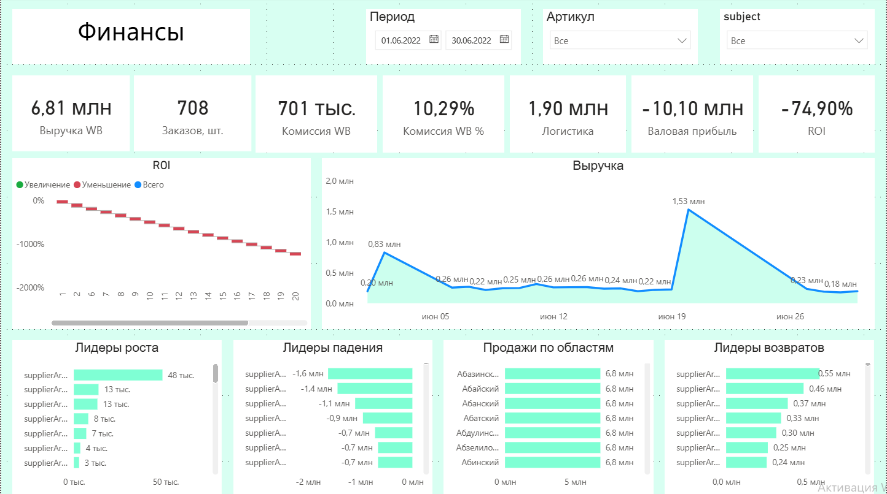

# WB Finance Dashboard

**Power BI dashboard for Wildberries financial analytics**

---

# О проекте

Финансовый дашборд для анализа продаж на Wildberries в Power BI.

Проект разработан для оценки ключевых финансовых показателей бизнеса на маркетплейсе Wildberries. Отчет позволяет анализировать выручку, комиссию, логистику, валовую прибыль, ROI, динамику продаж, лидеров роста и падения, а также возвраты и продажи по регионам.

---

# Цель проекта

Создать наглядный финансовый отчет в Power BI для мониторинга эффективности продаж и принятия управленческих решений.

---

# Что показывает отчет

* Выручка Wildberries
* Количество заказов
* Комиссия WB
* Комиссия WB %
* Логистика
* Валовая прибыль
* ROI
* Лидеры роста
* Лидеры падения
* Продажи по областям
* Лидеры возвратов

---

# Источники данных

### Wildberries API / PostgreSQL

Факт таблицы:

* `public.v_report_realization` — финансовые данные
* `public.v_sales` — продажи
* `public.v_orders` — заказы

---

### Google Sheets (справочники)

* Себестоимость товаров
* Справочник номенклатуры
* Тарифы доставки

---

# Модель данных

Использована модель данных "звезда".

Основные связи:

* Calendar[Date] → v_report_realization[date]
* dim_product[nm_id] → v_report_realization[nm_id]
* Себестоимость[barcode] → dim_product[barcode]
* Тарифы доставки[subject] → dim_product[subject]

Все связи однонаправленные (1:*)

---

# Основные KPI

Карточки:

* Выручка WB
* Заказов, шт.
* Комиссия WB
* Комиссия WB %
* Логистика
* Валовая прибыль
* ROI

---

# Визуализации

Дашборд включает:

Верхняя панель:

* KPI карточки

Средний блок:

* ROI
* Динамика выручки

Нижний блок:

* Лидеры роста
* Лидеры падения
* Продажи по областям
* Лидеры возвратов

---

# Используемые технологии

* Power BI Desktop
* PostgreSQL
* SQL
* DAX
* Google Sheets

---

# Особенности проекта

* Построена модель данных Star Schema
* Реализован календарь для анализа динамики
* Рассчитаны финансовые метрики
* Созданы управленческие KPI
* Реализованы лидеры роста и падения
* Добавлена аналитика возвратов
* Настроены фильтры по периоду и товарам

---

# Скриншоты

Главная страница отчета

---

# Результат

Создан интерактивный финансовый отчет Power BI для анализа продаж на Wildberries, позволяющий отслеживать ключевые показатели бизнеса и принимать решения на основе данных.

---

# Автор

Екатерина Афаневич
Data / BI Analyst

GitHub:
https://github.com/Ekaterina-prog

